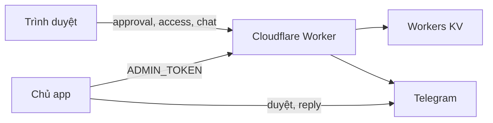

# Kiến trúc hệ thống

## Thành phần

- Cloudflare Pages phục vụ ba app tại `/`, `/boitoan/`, `/medora/`.
- `assets/gate.js` và `assets/gate.css` là gate dùng chung.
- Cloudflare Worker xử lý approval, telemetry, admin và chat.
- Workers KV lưu yêu cầu, phiên, sự kiện truy cập, log và tin nhắn.
- Telegram nhận yêu cầu duyệt, nút duyệt/từ chối và bản sao chat.

## Gate và mã hóa

Ba trang chứa payload AES-256-GCM. PBKDF2-SHA256 dẫn xuất khóa trong trình duyệt. `*.src.html` plaintext không được commit.

`window.GATE.mode`:

- `local`: mở bằng mật khẩu cục bộ.
- `encrypted`: giải mã cục bộ bằng mật khẩu.
- `approval`: gửi yêu cầu tới Worker; khi được duyệt, Worker trả JWT và `DECRYPT_KEY`.

Mật khẩu cục bộ không được gửi tới Worker. Payload tĩnh cho phép thử mật khẩu ngoại tuyến; khóa yếu hoặc khóa từng lộ làm mất bảo mật nội dung. `robots.txt` và `noindex` chỉ giảm khả năng bị lập chỉ mục, không phải kiểm soát truy cập.

## Approval và phiên

1. Frontend tạo browser UUID và gửi `/api/request`.
2. Worker lưu yêu cầu 7 ngày, rút gọn IP và thông báo Telegram.
3. Chủ duyệt qua Telegram hoặc `/admin`.
4. Worker cấp JWT HS256 v2, audience `gate-chat`, scope `access`, `log`, `chat`.
5. Session tương ứng nằm trong KV 12 giờ. Deny hoặc quyết định lại thu hồi session cũ.

JWT đơn lẻ chưa đủ: API luôn kiểm session KV còn active, đúng app, browser ID và chat ID.

## Telemetry thiết bị

`gate_device_id` là UUID dùng chung giữa ba app trong cùng browser profile. Mỗi lần reveal tạo `event_id` riêng và gọi `/api/access`.

Dữ liệu gồm app, browser-profile ID, phương thức mở, browser, ngôn ngữ, múi giờ, kích thước màn hình, platform, quốc gia và IP đã rút gọn. IPv4 giữ `/24`; IPv6 giữ `/64`. Không gửi mật khẩu.

Giới hạn:

- Không xác định duy nhất thiết bị vật lý.
- Xóa storage, private mode hoặc đổi browser tạo ID khác.
- Offline, tắt JavaScript, chặn request hoặc Worker lỗi làm mất sự kiện.
- KV list/metadata và rate limiting native có tính nhất quán best-effort.

Mỗi sự kiện truy cập hết hạn sau 90 ngày. Hồ sơ tổng hợp theo browser-profile hết hạn 90 ngày sau lần cập nhật thành công gần nhất. Admin đọc 250 hồ sơ mỗi request và frontend tải tiếp đến hết; số lượt vẫn gần đúng do KV và request có thể mất hoặc ghi đè khi đồng thời. Mốc 250 giữ tổng KV operations mỗi invocation dưới giới hạn 1.000 do Cloudflare công bố; cần đo production trước khi tăng.

## Chat

Chat chỉ hoạt động khi:

- `CHAT_ENABLED="true"`;
- JWT approval hợp lệ chứa scope `chat`;
- session KV còn active.

Tin khách được gửi tới Telegram. Chủ reply đúng tin bot để trả lời. KV giữ tin nhắn và mapping Telegram 30 ngày; frontend tải tối đa 100 tin gần nhất. Telegram giữ bản sao theo chính sách tài khoản/bot, độc lập TTL KV.

## Reader showcase

Mỗi app cấu hình `readers`. Frontend chỉ render mục có tên và URL HTTPS thuộc `facebook.com`, `www.facebook.com` hoặc `m.facebook.com`; nội dung dùng DOM text, không chèn HTML. Danh sách hiện đang rỗng.

## PWA

Root và Bói toán có manifest cùng Service Worker. Service Worker chỉ cache static allowlist; bỏ qua navigation, HTML mã hóa và API. Vì vậy offline shell có giới hạn nhưng không giữ payload nhạy cảm trong Cache Storage.

Manifest hiện chỉ khai icon PNG 512×512 đúng kích thước thật. Chưa tuyên bố sẵn sàng quảng bá cài đặt trên Chrome cho tới khi có icon 192×192 thật. ChPlay/App Store cần bước đóng gói, tài khoản developer, listing và quy trình review riêng.

## Retention

| Dữ liệu | TTL |
|---|---:|
| Yêu cầu approval, log | 7 ngày |
| Session | 12 giờ |
| Telemetry truy cập | 90 ngày |
| Chat và mapping Telegram | 30 ngày |
| Telegram update dedupe | 7 ngày |

## Triển khai

- `.github/workflows/deploy-pages.yml` test gate/SW rồi gộp ba app vào `_site` và deploy Pages.
- `.github/workflows/deploy-worker.yml` test Worker rồi deploy backend.
- `.github/workflows/setup-backend.yml` tạo KV, xoay secret phiên/webhook, deploy và nối webhook; chỉ dùng khi setup hoặc chủ động xoay secret.
- Wrangler pin `4.112.0` trong workflow.

Frontend và Worker có contract chung. Deploy phối hợp, kiểm thử đầu-cuối, rồi mới bật chat.
