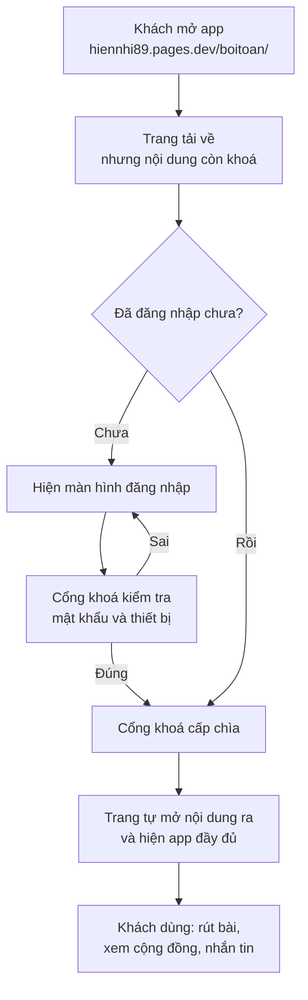
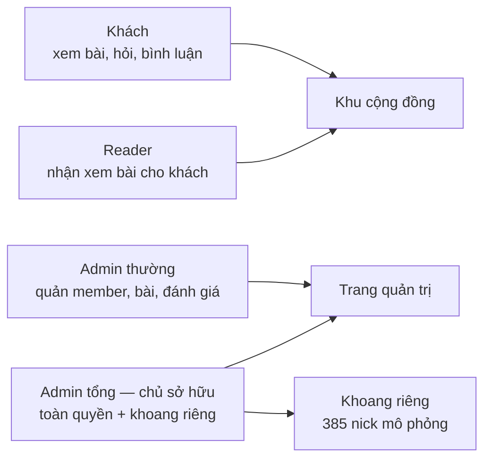
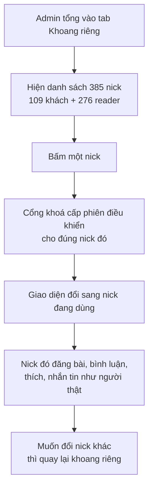
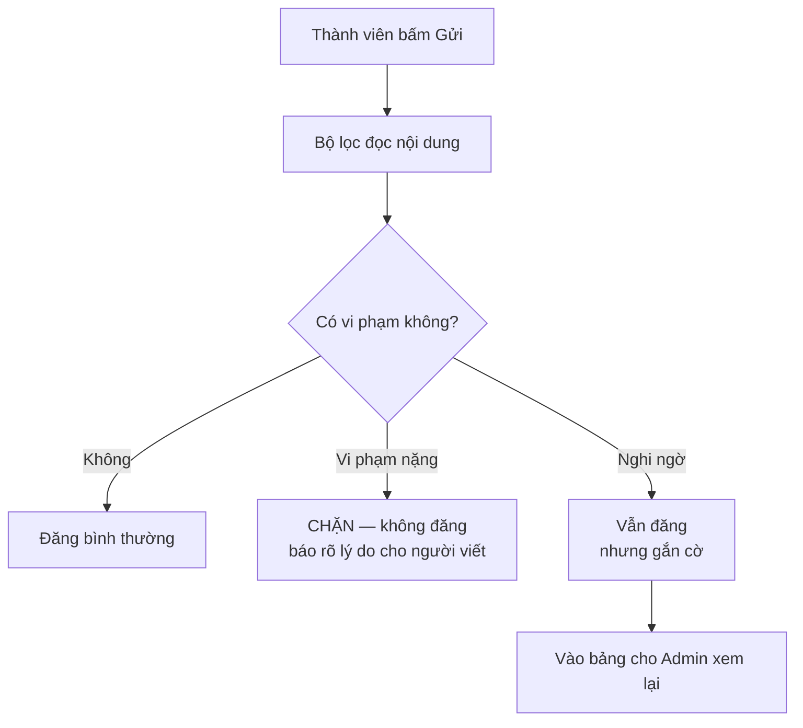
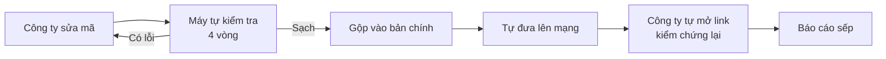

# Sơ đồ hệ thống — bản cho người không biết code

> Đọc file này là hiểu app đang chạy thế nào, ai giữ cái gì, và khi hỏng thì hỏng ở đâu.
> Không cần biết lập trình.

---

## 1. Ba phần của hệ thống, nói bằng tiếng thường

| Phần | Ví như | Việc của nó | Ở đâu |
|---|---|---|---|
| **Trang web** | Mặt tiền cửa hàng | Thứ khách nhìn thấy và bấm | `hiennhi89.pages.dev` |
| **Cổng khoá + kho dữ liệu** | Bảo vệ và kho hàng | Kiểm tra ai được vào, giữ tài khoản, bài viết, tin nhắn | `hiennhi89-gate.hiennhi89.workers.dev` |
| **Kho mã nguồn** | Bản thiết kế | Nơi cất toàn bộ mã và lịch sử sửa đổi | GitHub |

Nội dung app **được khoá lại**. Mở trang lên chưa đọc được gì cả; phải đăng nhập, cổng khoá kiểm tra
xong mới cấp chìa để trang tự mở nội dung ra. Vì vậy người lạ tải trang về cũng không xem trộm được.

---

## 2. Khách bấm vào app thì chuyện gì xảy ra

**Hỏng ở đâu thì thấy gì:**
- Cổng khoá bận hoặc hết hạn mức ghi → báo "chưa mở được phiên", **không phải sai mật khẩu**.
- Trang mở được nhưng nội dung trống → chìa cấp rồi mà nội dung chưa mở; đây là lỗi cần báo ngay.

---

## 3. Ba loại tài khoản

- **Khách** và **reader** là người thật đăng ký.
- **Admin thường** quản lý hằng ngày.
- **Admin tổng** là sếp: thấy thêm hội thoại riêng, trang cá nhân của member, và **khoang riêng**.

---

## 4. Khoang riêng 385 nick hoạt động ra sao

**Hai điều quan trọng:**
- 385 nick này **không có mật khẩu**, nên không ai từ ngoài đăng nhập vào được. Chỉ Admin tổng
  điều khiển từ bên trong.
- Phần **QR và số tài khoản để trống** — dành cho sếp tự đặt khi cần.

---

## 5. Bot kiểm duyệt tiêu chuẩn cộng đồng

Mọi nội dung thành viên viết ra — đánh giá, bình luận, tin nhắn — đều đi qua bộ lọc **trước khi lưu**.

**Nhóm bị chặn thẳng** (nguy hiểm cho người dùng và cho thương hiệu):

| Nhóm | Ví dụ bị chặn |
|---|---|
| Lừa đảo tiền bạc | "chuyển khoản trước", "cam kết hoàn vốn", "việc nhẹ lương cao" |
| Hứa chữa bệnh | "chữa khỏi ung thư", "không cần bác sĩ", "bỏ thuốc tây" |
| Cam kết đổi vận | "cam kết đổi vận", "đảm bảo trúng", "giải hạn 100%" |
| Đe doạ gieo sợ hãi | "không cúng là chết cả nhà", "nguyền rủa dòng họ" |
| Lộ thông tin cá nhân | số điện thoại, số tài khoản dán công khai |

**Nhóm gắn cờ để Admin xem lại** (không chặn ngay vì dễ nhầm): lời lẽ xúc phạm, kỳ thị, dấu hiệu
spam kéo người sang nơi khác.

Sếp xem những gì bị gắn cờ ở trang quản trị. Xử xong thì xoá khỏi bảng.

---

## 6. Sửa app rồi lên mạng thế nào

Bốn vòng kiểm tra tự động chạy trước khi bất cứ thứ gì được lên mạng. Chưa xanh đủ bốn vòng thì
không lên. Lên rồi công ty còn phải **tự mở link kiểm chứng** mới được báo là xong.

---

## 7. Khi có sự cố thì tìm ở đâu

| Sếp thấy | Nghĩa là | Ai sửa |
|---|---|---|
| Đăng nhập báo lỗi | Cổng khoá đang bận hoặc hết hạn mức ghi trong ngày | Công ty |
| Bấm nick trong khoang riêng không được | Hồ sơ nick đó bị thiếu dữ liệu | Công ty |
| Nội dung đọc khó hiểu, sai giọng | Kho chữ cần sửa | Công ty |
| Cần đặt QR / số tài khoản | Chỉ sếp làm được | Sếp |
| Cần nâng gói dịch vụ, thanh toán | Chỉ sếp làm được | Sếp |

Ba việc cuối là **điểm chạm con người duy nhất** theo quy tắc công ty. Ngoài ba việc đó, công ty
không được hỏi sếp mà phải tự làm.
